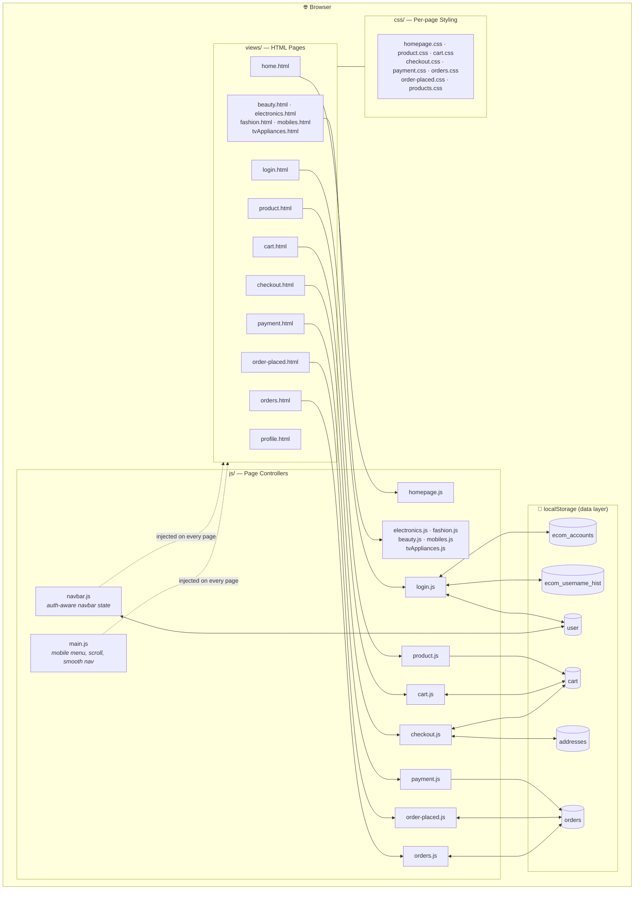
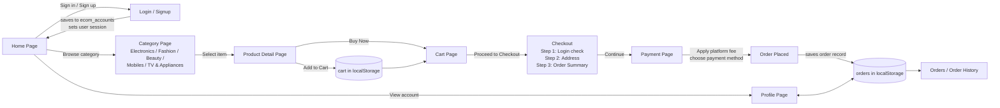

# 🛍️ BrandHub

A semi-dynamic, multi-category **e-commerce front-end** built entirely with **HTML, CSS &amp; vanilla JavaScript**. BrandHub recreates the core shopping experience of a marketplace (think Flipkart/Amazon-style flows) — browsing, authentication, cart, checkout, payments and order history — without any backend server, using `localStorage` as the persistence layer.

---

## ✨ Features

- 🔐 **Authentication** — signup/login with username history ("recent accounts" chips) and session persistence
- 🗂️ **Category browsing** — Electronics, Fashion, Beauty, Mobiles, TV & Appliances
- 🛒 **Cart management** — add/remove items, quantity updates, live price summary
- 💳 **Multi-step checkout** — address selection → order summary → payment
- 💰 **Payment simulation** — platform fee handling, multiple payment options
- 📦 **Order tracking** — order placed confirmation + order history
- 👤 **User profile** — saved addresses & account details
- 📱 **Responsive navbar** — adapts login/logout/profile state across every page

---

## 🧰 Tech Stack

| Layer | Technology |
|---|---|
| Structure | HTML5 (one file per page, under `views/`) |
| Styling | CSS3 (one stylesheet per page, under `css/`) |
| Behavior | Vanilla JavaScript (ES6, one module per page, under `js/`) |
| Persistence | Browser `localStorage` (acts as a mock database) |
| Shared logic | `main.js` (mobile nav, smooth scroll), `navbar.js` (auth-aware nav) |

---

## 🏗️ Architecture

BrandHub follows a **page-per-feature** architecture. Every view is a standalone HTML file paired with its own CSS and JS file, while a small set of shared scripts provide cross-page concerns (navigation state, mobile menu). `localStorage` plays the role of the backend/database, storing accounts, the active session, the cart and saved orders.



---

## 🔄 User & Data Flow

The diagram below traces a typical shopping journey end-to-end, showing how state is carried between pages purely via `localStorage`.



---

## 📁 Project Structure

```
BrandHub-main/
├── README.md
├── css/
│   ├── cart.css
│   ├── checkout.css
│   ├── homepage.css
│   ├── order-placed.css
│   ├── orders.css
│   ├── payment.css
│   ├── product.css
│   └── products.css
├── js/
│   ├── main.js          # shared: mobile menu, scroll-to-top, smooth scroll
│   ├── navbar.js         # shared: auth-aware navbar (login/logout/profile)
│   ├── homepage.js
│   ├── login.js          # accounts, session, username history
│   ├── electronics.js
│   ├── fashion.js
│   ├── beauty.js
│   ├── mobiles.js
│   ├── tvAppliances.js
│   ├── product.js
│   ├── cart.js
│   ├── checkout.js
│   ├── payment.js
│   ├── order-placed.js
│   └── orders.js
└── views/
    ├── home.html
    ├── login.html
    ├── electronics.html
    ├── fashion.html
    ├── beauty.html
    ├── mobiles.html
    ├── tvAppliances.html
    ├── product.html
    ├── cart.html
    ├── checkout.html
    ├── payment.html
    ├── order-placed.html
    ├── orders.html
    └── profile.html
```

---

## 🗄️ LocalStorage Schema

| Key | Type | Description |
|---|---|---|
| `ecom_accounts` | `{ username: password }` | All registered accounts |
| `ecom_username_hist` | `string[]` (max 8) | Recently used usernames, shown as chips on the login page |
| `user` | `string` | Currently logged-in user (session) |
| `cart` | `Array<Item>` | Items added from the product page |
| `orders` | `Array<Order>` | Confirmed orders, shown on Orders & Order Placed pages |
| `addresses` | `Array<Address>` | Saved delivery addresses used in checkout |

---

## 🚀 Getting Started

No build tools or dependencies required.

```bash
git clone <repo-url>
cd BrandHub-main
# open the home page directly...
open views/home.html
# ...or serve it locally for full relative-path support
python3 -m http.server 8000
# then visit http://localhost:8000/views/home.html
```

---

## 🔮 Future Improvements

- Replace `localStorage` with a real backend (Node/Express + MongoDB) and REST APIs
- Add product search & filtering across categories
- Wishlist functionality
- Real payment gateway integration
- Unit tests for cart/checkout calculations
